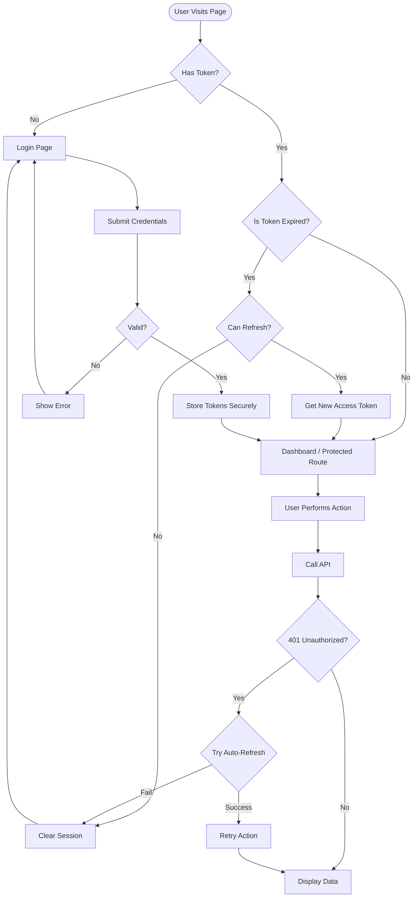

# Authentication System Architecture

## Overview
The **Entrance Gateway CMS** employs a robust, secure, and production-ready authentication system designed to protect against common web vulnerabilities (XSS, CSRF) while ensuring a seamless user experience. The system uses **JWT (JSON Web Tokens)** for stateless authentication, with a client-side architecture that prioritizes security and reliability.

---

## 🏗️ Core Architecture

The authentication system is built around three primary service layers:

### 1. **Auth Service** (`src/auth/services/authService.js`)
The high-level orchestrator for all authentication operations.
- **Responsibilities:** Login, Logout, Registration, Session Validation.
- **Key Logic:**
  - Handles API communication for auth endpoints.
  - Sanitizes user input (email, name) before sending to server.
  - Extracts user roles from API response or decodes them from the JWT if missing.
  - Manages the token refresh flow.

### 2. **Token Service** (`src/auth/services/tokenService.js`)
The low-level security vault for managing sensitive tokens.
- **Storage Strategy:** **Hybrid Approach**
  - **Primary (Memory):** Tokens are stored in a closure variable (`tokenStore`) which is inaccessible to XSS attacks.
  - **Backup (Encrypted LocalStorage):** An encrypted snapshot of the session is stored in `localStorage` to persist login across page reloads.
- **Encryption:** Uses a simple XOR-based encryption with a configurable key (`VITE_TOKEN_ENCRYPTION_KEY`) to obfuscate tokens in local storage.
- **Legacy Support:** Maintains `token` and `userId` keys for backward compatibility with older components.

### 3. **Axios Interceptor** (`src/pages/login/axiosInterceptor.js`)
A global HTTP middleware that ensures every request is authenticated and secure.
- **Request Phase:**
  - Automatically attaches `Authorization: Bearer <token>` header.
  - Sanitizes outgoing JSON bodies to prevent injection attacks.
  - Sets secure headers (`X-Requested-With`).
- **Response Phase:**
  - Sanitizes incoming JSON data.
  - **Automatic Token Refresh:** Intercepts `401 Unauthorized` responses, queues the failed request, attempts to refresh the token, and retries the original request seamlessly.

---

## 🔒 Security Patterns & Best Practices

### 1. Token Storage & Lifecycle
| Component | Storage Location | Security Property | Description |
|-----------|------------------|-------------------|-------------|
| **Access Token** | In-Memory (JS Variable) | **High** | Immune to XSS reading; lost on verify refresh. |
| **Backup** | Encrypted `localStorage` | **Medium** | Obfuscated storage for persistence across reloads. |
| **Refresh Token** | In-Memory + Backup | **Medium** | Used to obtain new access tokens. |

- **Token Rotation:** On every refresh, the server may issue a new Refresh Token, which is automatically updated in storage.
- **Proactive Refresh:** The system schedules an automatic background refresh 2 minutes before the Access Token expires.

### 2. Login Flow
1. **Rate Limiting:** `rateLimitService.js` checks client-side counters to prevent brute-force attacks.
2. **Input Sanitization:** Email is validated and cleaned; Password is verified for existence.
3. **API Authentication:** Credentials sent to `/api/v1/auth/login`.
4. **Role Extraction:**
   - Checks response body for `user.role`.
   - If missing, decodes the JWT (`parseJwt`) to find `role` or `roles` claim.
   - Defaults to `'admin'` if no role found.
5. **Secure Storage:** Tokens are saved to memory and encrypted backup.

### 3. Automatic Log Replay (Interceptor)
When a request fails with `401 Unauthorized`:
1. The request is **paused** and added to a `failedRequestsQueue`.
2. A flag `isRefreshing` is set to `true`.
3. `authService.refreshAccessToken()` is called.
4. **Success:** The queue is processed, and all paused requests are retried with the new token.
5. **Failure:** The user is forcibly logged out (`tokenService.clearTokens()`) and redirected to login.

### 4. Role-Based Access Control (RBAC)
- **UI Protection:** `Sidebar.jsx` and `Dashboard.jsx` conditionally render elements based on `tokenService.getUserRole()`.
- **Route Protection:** `ProtectedRoute.jsx` wraps admin routes. It checks `tokenService.isAuthenticated()` but **does not** enforce specific roles (that is done at the page level or Sidebar).
- **Audit Logs:** Only visible to `SUPER_ADMIN` (case-insensitive check: `super_admin` or `SUPER_ADMIN`).

### 5. Logout Strategy
The `logout()` function performs a **comprehensive cleanup** to prevent "ghost sessions":
1. **Clear Memory:** Resets the in-memory `tokenStore`.
2. **Clear Backup:** Removes encrypted keys from `localStorage`.
3. **Clear Legacy:** Removes old `token` and `userId` keys.
4. **Server Invalidate:** Sends a request to `/api/v1/auth/logout` (best-effort).
5. **Reset Limits:** Clears client-side rate limit counters.

83: 
84: ---
85: 
86: ## 🔄 Authentication Flows
87: 
88: ### 1. Login Logic Flow
89: 
90: ```mermaid
91: sequenceDiagram
92:     participant User
93:     participant UI as Login Page
94:     participant Rate as RateLimitService
95:     participant Auth as AuthService
96:     participant API as Backend API
97:     participant Token as TokenService
98: 
99:     User->>UI: Enters Email/Password
100:     UI->>Rate: canAttemptLogin()
101:     alt Rate Limit Exceeded
102:         Rate-->>UI: Block Request
103:         UI-->>User: Show Lockout Message
104:     else Allowed
105:         UI->>Auth: login(credentials)
106:         Auth->>Auth: Sanitize Input
107:         Auth->>API: POST /api/v1/auth/login
108:         
109:         alt Success (200)
110:             API-->>Auth: { accessToken, refreshToken, user }
111:             Auth->>Auth: Extract Role (User obj or JWT decode)
112:             Auth->>Token: storeTokens()
113:             Token->>Token: Save to Memory
114:             Token->>Token: Encrypt & Save to LocalStorage
115:             Auth->>Rate: recordSuccessfulLogin()
116:             Auth-->>UI: Success
117:             UI->>User: Redirect to Dashboard
118:         else Failure (401/403)
119:             API-->>Auth: Error
120:             Auth->>Rate: recordFailedAttempt()
121:             Auth-->>UI: Show Error
122:         end
123:     end
124: ```
125: 
126: ### 2. Automatic Token Refresh Flow (Interceptor)
127: 
128: ```mermaid
129: sequenceDiagram
130:     participant App as Application
131:     participant Axios as Axios Interceptor
132:     participant API as Backend API
133:     participant Auth as AuthService
134:     participant Token as TokenService
135: 
136:     App->>Axios: GET /protected/resource
137:     Axios->>Token: getAccessToken()
138:     Axios->>API: Request with Bearer Token
139:     
140:     alt Token Valid
141:         API-->>App: 200 OK (Data)
142:     else Token Expired (401)
143:         API-->>Axios: 401 Unauthorized
144:         Axios->>Axios: Queue Request
145:         Axios->>Auth: refreshAccessToken()
146:         Auth->>Token: getRefreshToken()
147:         Auth->>API: POST /api/v1/auth/refresh
148:         
149:         alt Refresh Success
150:             API-->>Auth: New Access Token
151:             Auth->>Token: updateAccessToken()
152:             Auth-->>Axios: Success
153:             Axios->>API: Retry Queued Request (New Token)
154:             API-->>App: 200 OK (Data)
155:         else Refresh Failed
156:             API-->>Auth: 401/403 Invalid Refresh Token
157:             Auth->>Token: clearTokens()
158:             Auth-->>Axios: Failure
159:             Axios-->>App: Reject Promise
160:             App->>App: Redirect to Login
161:         end
162:     end
163: ```
164: 
165: ### 3. Logout Flow
166: 
167: ```mermaid
168: graph TD
169:     A[User Clicks Logout] --> B[AuthService.logout]
170:     B --> C[TokenService.clearTokens]
171:     C --> D[Clear Memory Store]
172:     C --> E[Remove Encrypted LocalStorage]
173:     C --> F[Remove Legacy Keys]
174:     B --> G[API Call: /logout]
175:     G --> H[Redirect to /login]
176: ```
177: 
178: ---

## 📂 File Structure

```
src/
├── auth/
│   ├── config/
│   │   └── securityConfig.js       # Configuration constants (endpoints, timeouts)
│   ├── services/
│   │   ├── authService.js          # Main auth logic
│   │   ├── tokenService.js         # Token storage & encryption
│   │   └── rateLimitService.js     # Brute-force protection
│   └── utils/
│       ├── inputSanitizer.js       # XSS prevention
│       └── passwordValidator.js    # Strength checks
├── Verification/
│   └── ProtectedRoute.jsx          # Route guard component
└── pages/login/
    └── axiosInterceptor.js         # HTTP middleware
```

## ⚠️ Key Considerations
- **Environment Variables:** Ensure `VITE_TOKEN_ENCRYPTION_KEY` is set in `.env` for production.
- **Case Sensitivity:** Role checks handle both `SUPER_ADMIN` and `super_admin`.
- **Legacy Compatibility:** Do not remove `localStorage.setItem('token', ...)` until all older components are refactored to use `tokenService`.

---

### 4. Complete Auth Lifecycle Flowchart
This high-level diagram shows the decision making process for the entire user session.


