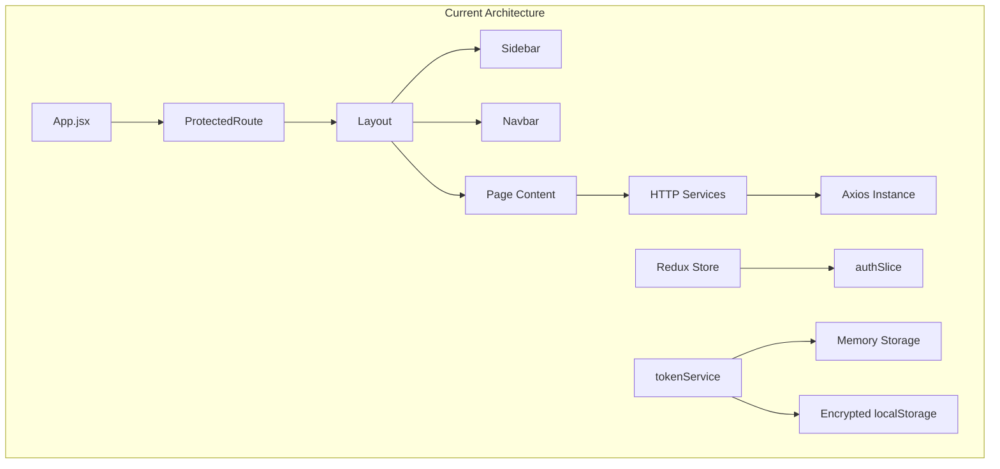

# Entrance Gateway CMS - Codebase Analysis & Improvement Plan

## Executive Summary

This document provides a comprehensive analysis of the **entrance_gateway_cms** React codebase, identifying issues and proposing targeted improvements based on actual code examination. The project is a Vite + React 19 CMS application with TailwindCSS v4, Redux Toolkit, and React Router v7.

---

## 1. Folder Structure Analysis

### Current Structure
```
entrance_gateway_cms/
├── components/           # Root-level shared components (4 items)
│   ├── Sidebar/
│   ├── Spinner/
│   ├── layout/
│   └── navbar/
├── src/
│   ├── auth/             # Authentication module
│   │   ├── components/
│   │   ├── config/
│   │   ├── services/
│   │   └── utils/
│   ├── Banner/           # PascalCase folder
│   ├── Category/         # PascalCase folder  
│   ├── Verification/     # PascalCase folder
│   ├── components/       # DUPLICATE - src-level components
│   │   ├── FileViewer/
│   │   └── pdfview/
│   ├── globals/
│   ├── http/             # API services
│   ├── pages/            # Page modules (11 modules, 65 children)
│   └── quiz/             # Quiz module
├── store/                # Redux store (outside src!)
└── docs/
```

### Issues Identified

| Issue | Location | Severity |
|-------|----------|----------|
| Dual component folders | `/components` + `/src/components` | High |
| Redux store outside src | `/store` vs expected `/src/store` | Medium |
| Inconsistent folder casing | `Banner`, `Category`, `Verification` (PascalCase) vs `pages`, `http` (lowercase) | Medium |
| Unusual folder naming | `src/pages/notes/components/form.jsx/` (folder with .jsx extension) | High |
| Deep nesting | `src/pages/notes/components/form.jsx/NotesFrom.jsx` | Medium |

### Recommended Structure
```diff
entrance_gateway_cms/
- ├── components/                # REMOVE - merge into src/components
  ├── src/
+ │   ├── components/            # UNIFIED shared components
+ │   │   ├── layout/
+ │   │   ├── navigation/        # Sidebar, Navbar
+ │   │   ├── common/            # Spinner, etc.
+ │   │   └── pdf/               # FileViewer, pdfview
- │   ├── Banner/               
- │   ├── Category/             
- │   ├── Verification/         
+ │   ├── features/              # Feature modules
+ │   │   ├── banner/
+ │   │   ├── category/
+ │   │   └── verification/
+ │   ├── store/                 # MOVE Redux here
  │   ├── http/                  
  │   ├── pages/                 
  │   └── quiz/                  
- ├── store/                     # MOVE to src/store
```

---

## 2. UI Consistency Analysis

### Layout Pattern
**Positive**: Consistent use of `Layout` wrapper component across pages.

```jsx
// Observed pattern in multiple files
import Layout from "../../../components/layout/Layout";

const SomePage = () => (
  <Layout>
    <div className="p-6">
      <SomeComponent />
    </div>
  </Layout>
);
```

### Issues Identified

| Issue | Example | Files Affected |
|-------|---------|----------------|
| Double padding | Layout has `<main className="p-6">`, pages add `<div className="p-6">` | BlogPage.jsx, AllAds.jsx, others |
| Inconsistent import paths | `../../../components/layout/Layout` varies based on depth | All page files |
| Hardcoded stats in Dashboard | Shows static numbers (42, 210, 350, 1420) | Dashboard.jsx |
| React hooks in IIFE | Dashboard uses useState/useEffect inside `(() => { ... })()` | Dashboard.jsx:44-63 |

### Dashboard Anti-Pattern Found
```jsx
// ❌ ANTI-PATTERN in Dashboard.jsx:36-118
{(() => {
  const [logs, setLogs] = useState([]);  // Hooks inside IIFE!
  const [loading, setLoading] = useState(true);
  
  useEffect(() => { ... }, []);
  
  return (...);
})()}
```

> [!CAUTION]
> This violates React hooks rules. Hooks must be called at the top level of the component, not inside IIFEs, loops, or conditions.

### Recommended Fixes

#### [MODIFY] Dashboard.jsx
- Extract audit logs section into a separate `RecentAuditLogs` component
- Fetch real dashboard statistics from API
- Move hooks to component top level

#### [MODIFY] Multiple page files
- Remove inner `p-6` padding (Layout already provides it)
- Use path aliases to simplify imports

---

## 3. Scalability Assessment

### Current Route Count
The App.jsx file has **~45 routes** defined with lazy loading. This is manageable but will become unwieldy as the application grows.

### Route Organization Issues
```jsx
// Current: All routes in single App.jsx (194 lines)
<Route path="/college/add" element={<AddCollege />} />
<Route path="/college/edit/:id" element={<EditCollege />} />
<Route path="/college/all" element={<CollegeAll />} />
// ... 40+ more routes
```

### Recommendations

#### Route Splitting Strategy
```jsx
// Proposed: Module-based route files
// src/routes/index.jsx
export const routes = [
  ...collegeRoutes,
  ...courseRoutes,
  ...notesRoutes,
  ...blogRoutes,
  ...quizRoutes,
  ...adminRoutes,
];

// src/routes/college.routes.jsx
export const collegeRoutes = [
  { path: "/college/add", element: <AddCollege /> },
  { path: "/college/edit/:id", element: <EditCollege /> },
  { path: "/college/all", element: <CollegeAll /> },
];
```

### Data Fetching Scalability
**Positive**: Uses React Query pattern with custom hooks would improve caching. Currently using direct axios calls.

---

## 4. Optimization Opportunities

### Identified Optimizations

| Category | Issue | Solution | Impact |
|----------|-------|----------|--------|
| Bundle | Unused import in vite.config.js | Remove `Server` from lucide-react | Minor |
| Code | Duplicate `isAuthenticated` export | Remove duplicate in tokenService.js:372 | Minor |
| Lazy Loading | Good use of Suspense + lazy | No change needed | ✓ |
| Token Storage | Inconsistent token access | Standardize on tokenService | High |

### Token Handling Inconsistency
```jsx
// ❌ INCONSISTENT: Direct localStorage access
// Found in: AddForm.jsx:7
const token = localStorage.getItem("token");

// ✓ CORRECT: tokenService usage
// Found in: ProtectedRoute.jsx, Adminlogin.jsx
const isAuth = tokenService.isAuthenticated();
const token = tokenService.getAccessToken();
```

> [!WARNING]
> 8+ files use direct `localStorage.getItem("token")` instead of the secure `tokenService`. This bypasses encryption and security measures.

### Files Requiring Token Access Refactor
- `src/pages/notes/AddForm.jsx`
- `src/pages/notes/EditForm.jsx`  
- Various other page files using `localStorage.getItem("token")`

---

## 5. Component Usability Analysis

### Reusable Components Identified
| Component | Location | Reusability |
|-----------|----------|-------------|
| Layout | `/components/layout/Layout.jsx` | ✓ High - used everywhere |
| Sidebar | `/components/Sidebar/Sidebar.jsx` | ✓ High - single instance |
| Spinner | `/components/Spinner/Spinner.jsx` | ✓ High - Suspense fallback |
| NoteForm | `/src/pages/notes/components/` | Medium - notes-specific |
| BlogForm | `/src/pages/blog/components/BlogForm.jsx` | Medium - blog-specific |
| BlogTable | `/src/pages/blog/components/BlogTable.jsx` | Medium - blog-specific |

### Missing Shared Components
The codebase would benefit from these shared components:

1. **DataTable** - Generic table with pagination, sorting, search
2. **ConfirmModal** - Reusable delete/action confirmation
3. **FormField** - Standardized form input wrapper
4. **PageHeader** - Consistent page title + actions bar
5. **EmptyState** - "No data found" component
6. **LoadingState** - Skeleton loaders

### Form Duplication
Each module (notes, blog, ads, syllabus) has its own form component. Consider a form builder pattern.

---

## 6. API Implementation Analysis

### HTTP Service Pattern
**Location**: `/src/http/`

```jsx
// Consistent pattern observed
export const createNote = async (formData, token) => {
  try {
    return await api.post("/api/v1/notes", formData, {
      headers: { Authorization: `Bearer ${token}` },
    });
  } catch (err) {
    throw err.response?.data || err;
  }
};
```

### Issues Identified

| Issue | File | Description |
|-------|------|-------------|
| Mixed concerns | ads.js | UI constants (AD_POSITIONS, AD_STATUSES) mixed with API calls |
| Token passed as param | All HTTP files | Should use axios interceptor instead |
| Inconsistent error format | Various | Some use `{ error: "msg" }`, others throw raw error |

### Positive Patterns
- ✓ Centralized axios instance with baseURL
- ✓ Development-only request/response logging
- ✓ Proper timeout configuration (30s)
- ✓ Vite proxy for API requests in dev mode

### Recommendations

#### [MODIFY] index.js
Add request interceptor to automatically attach auth token:
```jsx
API.interceptors.request.use((config) => {
  const token = tokenService.getAccessToken();
  if (token) {
    config.headers.Authorization = `Bearer ${token}`;
  }
  return config;
});
```

#### [MODIFY] All HTTP service files
- Remove token parameter from all functions
- Separate UI constants into `/src/constants/` directory

---

## 7. Architecture Evaluation

### Overall Assessment

| Aspect | Rating | Notes |
|--------|--------|-------|
| Security | ★★★★☆ | Excellent security config, RBAC, XSS/SQL patterns |
| State Management | ★★★★☆ | Good Redux Toolkit usage, proper thunks |
| Auth Flow | ★★★★☆ | Encrypted token storage, refresh mechanism |
| File Organization | ★★☆☆☆ | Scattered structure, duplicate folders |
| Code Consistency | ★★★☆☆ | Mixed patterns, token access inconsistency |
| Performance | ★★★★☆ | Good lazy loading, could add caching |

### Security Strengths
- securityConfig.js - OWASP password requirements, rate limiting, XSS patterns
- tokenService.js - Encrypted localStorage backup, in-memory primary storage
- authSlice.js - Proper async thunks with error handling

### Architecture Diagram


---

## Improvement Plan - Prioritized Actions

See detailed phase documents:
- [Phase 1: Critical Fixes](./PHASE-1-CRITICAL-FIXES.md) - Immediate (1-2 days)
- [Phase 2: Structure Improvements](./PHASE-2-STRUCTURE-IMPROVEMENTS.md) - Short-term (3-5 days)
- [Phase 3: Code Quality](./PHASE-3-CODE-QUALITY.md) - Medium-term (1-2 weeks)
- [Phase 4: Scalability](./PHASE-4-SCALABILITY.md) - Long-term (2-4 weeks)

---

## Summary

The codebase has **strong security foundations** but suffers from **organizational inconsistencies**. The most critical issues are:

1. ❌ React hooks violation in Dashboard (renders but violates rules)
2. ❌ Token access bypasses secure tokenService
3. ❌ Scattered component locations
4. ❌ No automated tests

> [!TIP]
> Start with Phase 1 fixes as they address actual bugs and security concerns. The structural changes in Phase 2-4 can be done incrementally.
